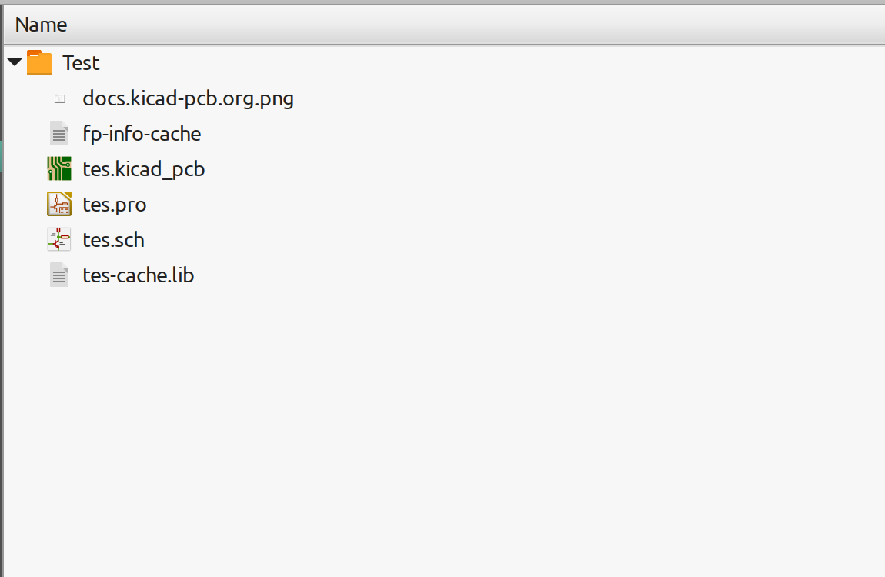
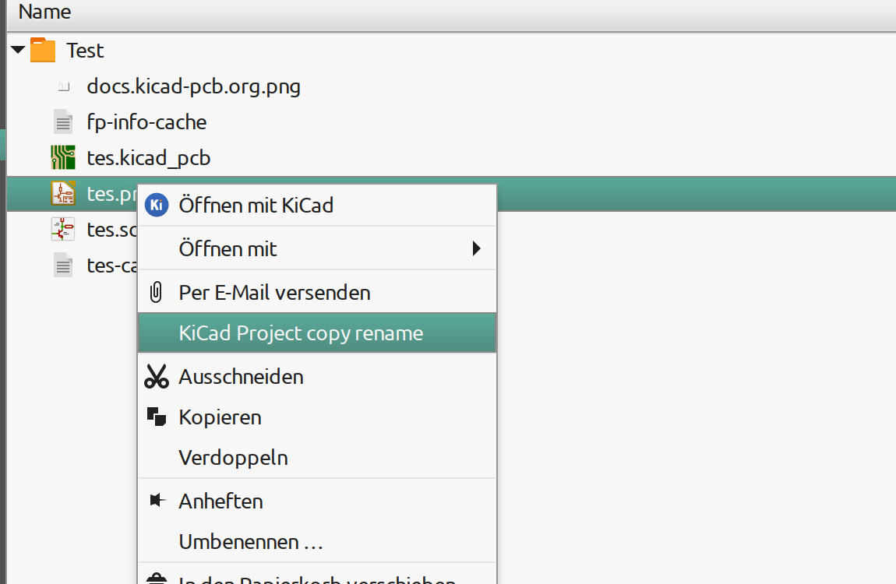
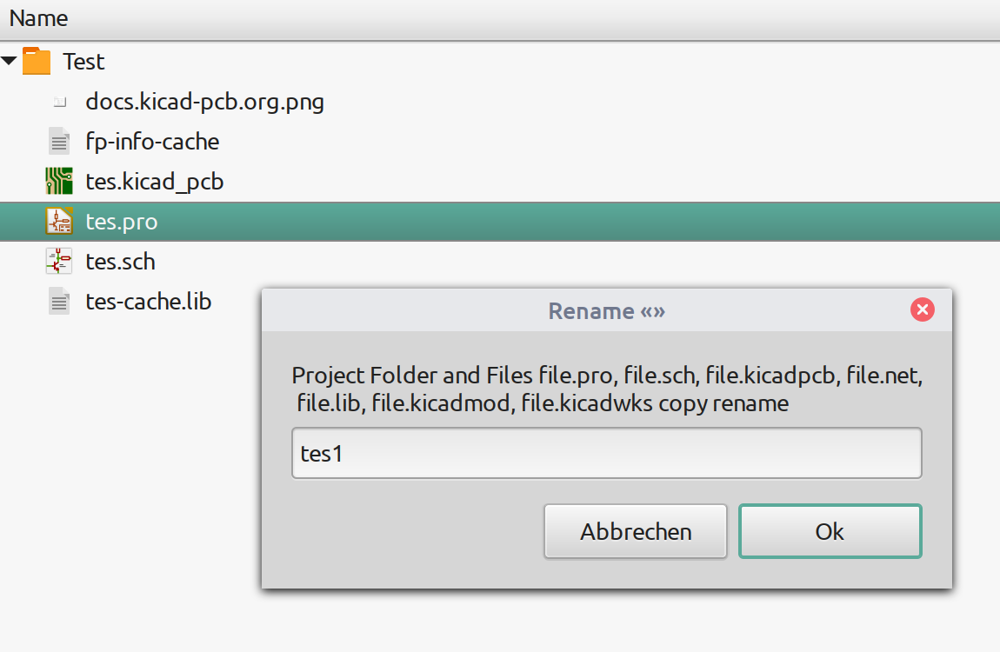
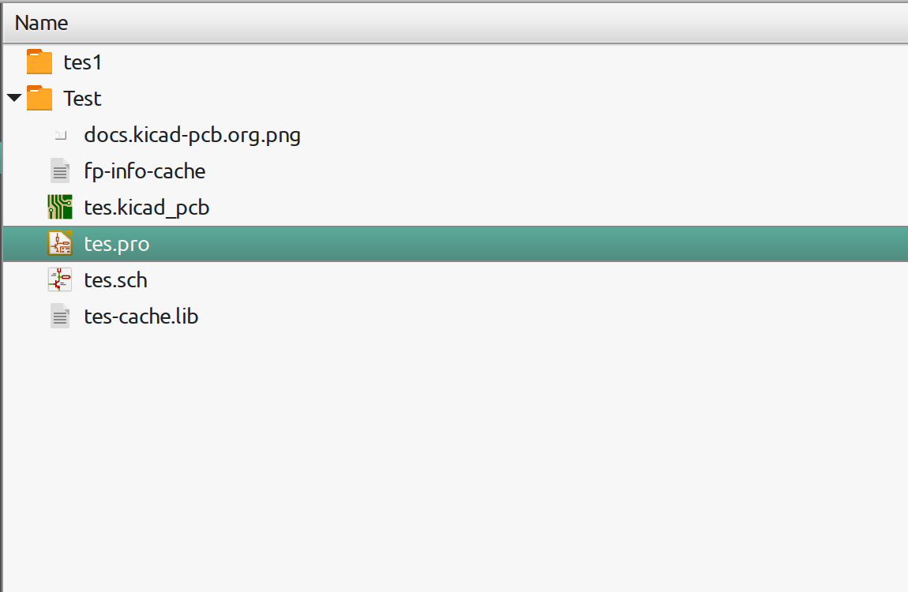

## Nemo Action script to quickly rename KiCad project files ##  

This repository contains a Nemo Action script. These scripts are installed in the **Nemo file manager** of the Linux Mint Cinnamon distribution. 
The script is intended to create a copy of the KiCad project with a different name.

## Detailed View on the Shell script to rename KiCad project files ##

#### Files ####

* file-copy-rename.nemo_action
* file-copy-rename/file-copy-rename.sh
* file-copy-rename/lang/de.ini
* file-copy-rename/lang/en.ini

#### Description ####
Pointing the KiCad project file with the mouse and right-clicking the item "KiCad Project copy rename" appears in the context menu. By clicking on the item "KiCad Project copy rename" a form is created for entering the name of the project.
Nemo Action script creates a folder. The file.pro, file.sch, file.kicad_pcb, file.net, file.lib, file.kicad_mod, file.kicad_wks files are copied to the folder and renames them.
The project name is entered into the dialog.

				

				

#### Prerequisites ####
Zenity is a utility that allows you to display GTK + dialogs from the command line and shell scripts.

## Install Nemo Actions  ##

 Fire up a terminal.
 
  Make sure you have the necessary program Zenity (for the nemo action you want) installed on your system. For the installation program Zenity you'll have to run:
<pre><code>sudo apt-get update
sudo apt-get install zenity </code></pre>
 
 Enter this directory:
<pre><code>cd ~/Downloads</code></pre>

 Clone the files from this repository to your computer:
<pre><code>git clone https://github.com/pic16f877ccs/NemoAction.git</code></pre>
 Go to this directory:
<pre><code>cd ~/Downloads/NemoAction/Nemo-action</code></pre>

 Copy the files and folders for the wanted nemo action to your nemo actions directory. Linux Mint stores the Nemo Actions in <code>~/.local/share/nemo/actions</code> (user) and <code>/usr/share/nemo/actions</code> (system-wide).
Also make sure the shell script is executable. E.g. for the "file-copy-rename.nemo_action" nemo action you'll have to run:
<pre><code>cp file-copy-rename.nemo_action  ~/.local/share/nemo/actions
mkdir ~/.local/share/nemo/actions/file-copy-rename
cp -r file-copy-rename/* ~/.local/share/nemo/actions/file-copy-rename
chmod +x ~/.local/share/nemo/actions/file-copy-rename/file-copy-rename.sh</code></pre>

